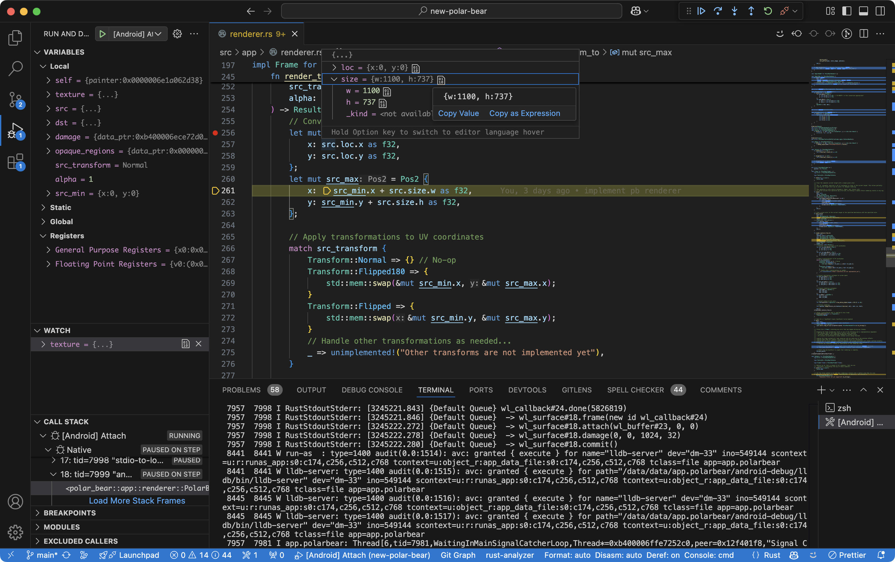

# New Polar Bear

Polar Bear helps you run a desktop Linux environment on your Android device.

> This is a Rust rewrite of the original [Polar Bear](https://github.com/polar-bear-app/polar-bear-app) project, which was written in Kotlin and C++. The aim of this rewrite is to make it more stable, portable, and able to do the development work on Android.

## Getting Started

### How to build an APK

```bash
cargo install xbuild
x build --platform android --arch arm64
```

### How to develop

Recommended setup:

- **IDE**: Visual Studio Code

- **Extensions**:
    - [Rust Analyzer](https://marketplace.visualstudio.com/items?itemName=rust-lang.rust-analyzer)
    - [Android Debug](https://marketplace.visualstudio.com/items?itemName=nisargjhaveri.android-debug)
    - [CodeLLDB](https://marketplace.visualstudio.com/items?itemName=vadimcn.vscode-lldb)

        > **Note**: CodeLLDB v1.11.2 has a bug when launching with Android Debug ([issue link](https://github.com/vadimcn/codelldb/issues/1220)). Please downgrade to v1.11.1 via Extensions tab > CodeLLDB > Install Specific Version... > v1.11.1 to work around the issue.

- **Instructions**: 
    1. Open Visual Studio Code.
    2. Launch the `[Android] Debug` configuration from the debug panel. This will build the Rust code into an APK, install the APK on a selectable device, and launch the app in debug mode.

- Alternatively, to view stdout/stderr logs (from `println!` and such), you can:
    1. Start the default build task by pressing `Ctrl+Shift+B`. This will delegate `xbuild` to run the app and redirect stdout/stderr output to the terminal.
    2. Launch the `[Android] Attach` configuration from the debug panel.  In the future, if the `[Android] Debug` configuration supports log viewing, **this configuration may be removed** for simplicity.



> **Tip**: You can debug the app on either a physical device or a virtual device.